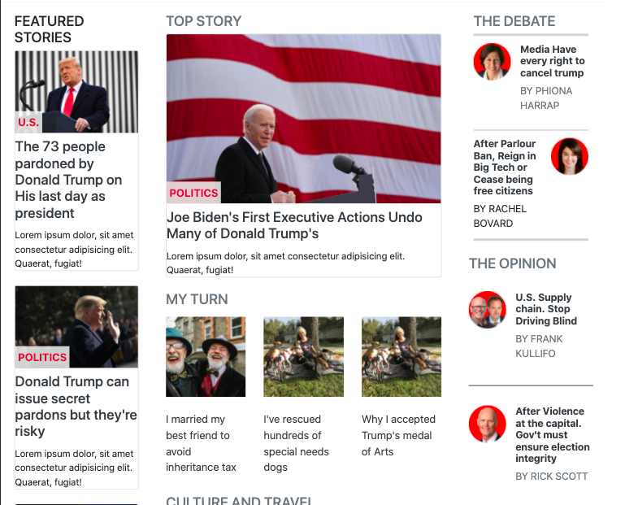
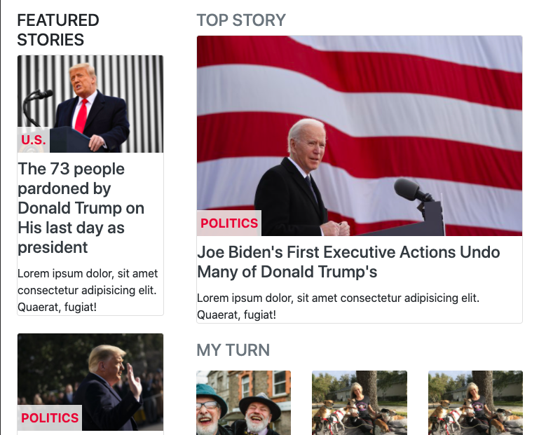
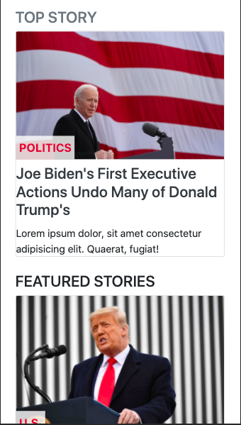

# News Week Web Clone

> This is a clone of an archived version of the [News Week Website](https://web.archive.org/web/20210120125445/https://www.newsweek.com/) as of Wed, Jan 20, 2020

## Milestone 2 Screen Shots

- Large screens

- Medium Screens

- Small Screens

- The goal of the project was to learn to use Bootstrap to design Responsive Web Pages.
- We used Bootstrap grid to position the different elements in columns.
- PS: The links on the page don't work. They are mainly dummy links.

## Built With

- HTML and CSS
- Bootstrap

## Authors

👤 **Lilian Moraa**

- GitHub: [@lily-coder](https://github.com/lily-coder)
- Twitter: [@LilianM53742529](https://mobile.twitter.com/LilianM53742529)
- LinkedIn: [Lilian Moraa](https://www.linkedin.com/in/lilian-moraa-99950b1b8)

👤 **Emmanuel Obonyo**

- GitHub: [@emmyobonyo](https://github.com/emmyobonyo)
- Twitter: [@emmyobonyo](https://twitter.com/emmyobonyo)
- LinkedIn: [Emmanuel Obonyo](https://www.linkedin.com/in/emmanuel-obonyo-3728a2200/)

## 🤝 Contributing

Contributions, issues, and feature requests are welcome!

Feel free to check the [issues page](https://github.com/lily-coder/newsweek-web-clone/issues).

## Show your support

Give a ⭐️ if you like this project! We'd really appreciate it.

## Acknowledgments

- Thanks to [Microverse](https://github.com/lily-coder/newsweek-web-clone/issues) for providing the [linters](https://github.com/microverseinc/linters-config/tree/master/html-css)

## 📝 License

This project is [MIT](./MIT.md) licensed.